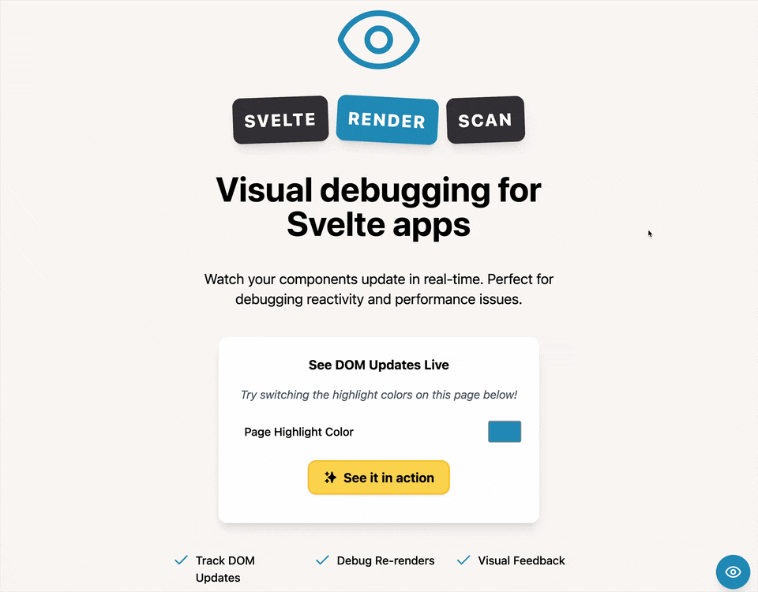

# Svelte Render Scan

Visual debugging tool for Svelte applications.

Svelte port of [render-scan](https://github.com/NullVoxPopuli/render-scan/).



## Installation

```bash
npm install -D svelte-render-scan
```

## Usage

```svelte
<script>
	import { RenderScan } from 'svelte-render-scan';
</script>

<RenderScan />
```

The overlay button appears in the bottom right corner and is enabled by default. You can disable it by clicking on it or setting the `initialEnabled` prop to `false`.

## Props

- `initialEnabled` (default: `true`) - Start with render scanning enabled
- `offsetLeft` (default: `0`) - Offset the button left from its default position
- `hideIcon` (default: `false`) - Hide the render scan button while keeping functionality active
- `callback` (default: `undefined`) - Optional user defined function that gets called once per valid mutation. Signature is `(mutation:MutationRecord)=>void;`
- `duration` (defult: `1000`) - Adjust how long the render scan highlights remain on screen in ms

## Development

Clone this repository and install dependencies:

```bash
nvm use
npm install
npm run dev
```

## License

MIT
